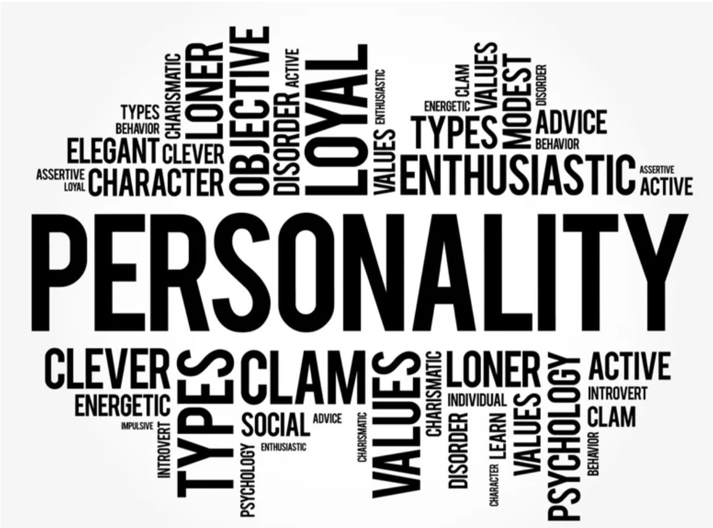

# Personality and Emotion Detection from Text Using NLP and Deep Learning

## Overview

This project aims to develop a deep learning-based system that predicts the **MBTI personality type** and **emotions** from text using Natural Language Processing (NLP) techniques. By analyzing textual input, this system can help identify personality traits and emotional states, enabling applications in personalized content recommendations, user experience design, and mental health analysis.

---

## Project Objectives

- **Personality Prediction:** Predict the **MBTI personality type** of a given text based on the **Essays-MBTI dataset**.
- **Emotion Detection:** Classify the emotional state of the text using the **GoEmotions dataset**.
- **Text Analysis:** Utilize state-of-the-art NLP techniques, such as **Word2Vec**, **GloVe**, and **BERT**, to process and analyze the text.
- **Integration:** Combine the personality and emotion models into one seamless prediction pipeline.

---

## Project Structure

The project is organized into the following modules and components:

- **Docs:** Contains project documentation including the introduction and roadmap.
- **Images:** Includes all images used for documentation and reports.
- **Notebooks:** Jupyter notebooks used for data exploration, model training, testing, and evaluation.
- **SRC:** Source code directory containing datasets, preprocessing scripts, and model training scripts.
- **Models:** Pretrained and custom models, including GloVe, Word2Vec, and neural network models for both personality and emotion detection.

---

## Tools and Technologies Used

- **Python 3.x**
- **TensorFlow / Keras**: For deep learning models (LSTM, GRU, BERT).
- **Pandas, Numpy**: For data manipulation and preprocessing.
- **Matplotlib, Seaborn**: For data visualization.
- **Scikit-learn**: For machine learning utilities like cross-validation and model evaluation.
- **GloVe, Word2Vec**: Pretrained word embeddings for text representation.
- **Google Colab / Jupyter Notebooks**: For interactive development and testing.
- **Transformers (Hugging Face)**: For fine-tuning BERT models.

---

## Dataset Overview

### 1. **Essays-MBTI Dataset**  
This dataset contains over 10,000 essays from individuals with different MBTI personality types. It is used to train the personality prediction model based on textual features.

### 2. **GoEmotions Dataset**  
A large-scale dataset that includes text labeled with 27 emotion categories, which is used to train the emotion detection model.

### 3. **Goodreads Dataset**  
Though not used directly in this project, this dataset contains book ratings and metadata, which may be useful for future improvements in content recommendation systems based on personality or emotion.

---

## Methodology

1. **Data Preprocessing**:  
   Clean and preprocess the datasets to extract text features and handle missing values.

2. **Word Embedding**:  
   Utilize **GloVe** and **Word2Vec** embeddings to represent words in a continuous vector space, which captures semantic relationships.

3. **Model Training**:  
   - For personality prediction, train models using LSTM and GRU architectures with GloVe/Word2Vec embeddings.
   - For emotion detection, fine-tune **BERT** on the GoEmotions dataset to classify text into emotional categories.

4. **Model Evaluation**:  
   Evaluate model performance using metrics like accuracy, F1 score, and confusion matrices. Fine-tune hyperparameters to improve results.

5. **Integration**:  
   Combine the personality and emotion models to create an integrated pipeline for simultaneous predictions.

---

## How to Run the Project

Upload notebooks to Kaggle notebook and add Required data and run all cells
---

## Expected Outcomes

- **Personality Type Prediction**: The system will classify the text into one of the 16 MBTI personality types, based on the writing style and features extracted from the dataset.
- **Emotion Classification**: The system will predict one of 27 possible emotions in the text, such as joy, sadness, anger, or surprise.
- **Real-Time Applications**: With further improvements, this model can be integrated into social media platforms, mental health apps, or personalized content recommendation systems.

---

## Contributions

Feel free to fork this repository, submit issues, or contribute improvements to the code. Contributions are welcome and encouraged!

---

## License

This project is licensed under the MIT License - see the [LICENSE.md](LICENSE.md) file for details.

---

## Acknowledgements

- **GoEmotions dataset** for providing labeled emotion data.
- **MBTI dataset** for making large-scale personality data available for research.
- **Hugging Face** for providing the Transformers library and pretrained models.
- **TensorFlow / Keras** for providing state-of-the-art deep learning frameworks.

